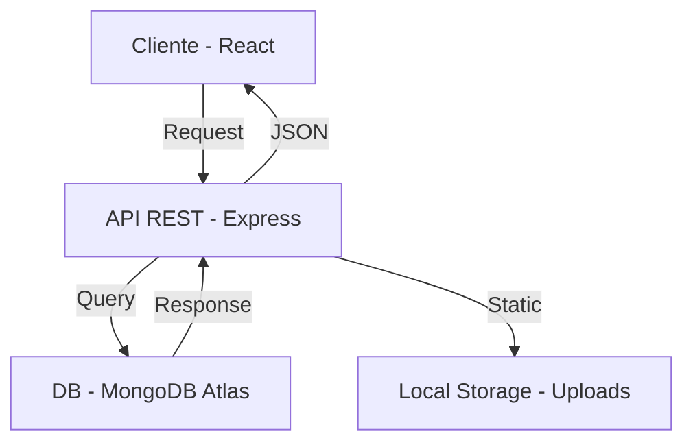

# 🎬 Cine Digital - Sistema de Gestión de Películas y Series

Este es un proyecto Full Stack desarrollado bajo el stack **MERN** (MongoDB, Express, React, Node.js). Proporciona una solución integral para la gestión de catálogos audiovisuales, con una interfaz moderna basada en **Glassmorphism** y funcionalidades CRUD completas para todos sus módulos.

---

## 📸 Vista de la Aplicación


---

## 🚀 Tecnologías Utilizadas

### Backend
- **Node.js** & **Express**: Servidor y API RESTful.
- **MongoDB Atlas**: Base de datos NoSQL en la nube.
- **Mongoose**: Modelado de objetos y esquemas.
- **Multer**: Gestión de carga de archivos (Imágenes).

### Frontend
- **React JS**: Interfaz de usuario dinámica.
- **React Router v5**: Gestión de rutas del lado cliente.
- **Bootstrap 5**: Estructura de layout responsiva.
- **SweetAlert2**: Experiencia de usuario mejorada con alertas estéticas.
- **Axios**: Comunicación fluida con el Backend.

---

## 🛠️ Instalación y Configuración

### 📋 Requisitos Previos
- [Node.js](https://nodejs.org/) (v16 o superior)
- Cuenta en [MongoDB Atlas](https://www.mongodb.com/cloud/atlas)
- Gestor de paquetes npm

### 1. Configuración del Backend
1. Navega a la carpeta del backend:
   ```bash
   cd backend
   ```
2. Instala las dependencias:
   ```bash
   npm install
   ```
3. Configura las variables de entorno:
   Crea un archivo `.env` basado en `.env.template` y define:
   - `PORT`: Puerto del servidor (ej. 4000).
   - `MONGO_URI`: Tu cadena de conexión de MongoDB Atlas.

4. Inicia el servidor de desarrollo:
   ```bash
   npm run dev
   ```

### 2. Configuración del Frontend
1. Navega a la carpeta del frontend:
   ```bash
   cd ../frontend
   ```
2. Instala las dependencias:
   ```bash
   npm install
   ```
3. Configura la URL del API:
   Asegúrate de que `src/services/axiosConfig.js` apunte al puerto correcto del backend.

4. Inicia la aplicación:
   ```bash
   npm start
   ```

---

## 🏁 Guía Rápida de Uso (Para el Evaluador)

Si ya tienes configurados los servicios, sigue estos pasos para navegar por la aplicación:

1.  **Abre el Catálogo:** Ingresa a [http://localhost:3000](http://localhost:3000). Verás el dashboard de películas y series cargado.
2.  **Gestiona Maestros:** Usa la barra de navegación superior para visitar:
    *   **Géneros:** Gestiona las categorías (Acción, Comedia, etc.).
    *   **Directores:** Registro de creadores.
    *   **Productoras:** Listado de marcas.
    *   **Tipos:** Filtros por formato (Streaming, Película).
3.  **Añadir Contenido:** En la página principal, haz clic en **"▼ Añadir Película/Serie"**. Podrás subir un poster local, elegir géneros del dropdown y guardar.
4.  **Ver Detalles:** Haz clic en **"👁️ VER DETALLES"** en cualquier tarjeta para ver la sinopsis completa.

> [!IMPORTANT]
> El sistema requiere que el **Backend** esté encendido simultáneamente para que las listas desplegables y el catálogo funcionen.

---

## 📂 Arquitectura del Proyecto



---

## 📁 Estructura de Carpetas
- `/backend`: API, Modelos, Rutas y Controladores.
- `/frontend`: Componentes React, Páginas y Servicios.
- `/uploads`: Almacenamiento temporal para posters de películas.

---

## 👤 Autor
Desarrollado para el módulo de **Ingeniería Web** por **Juan Diego Calle**.
Refinamiento de UI/UX asistido por **Antigravity AI**.
